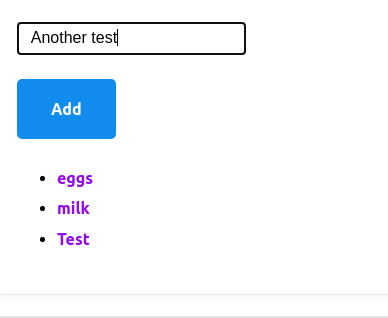
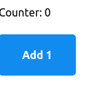
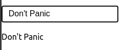
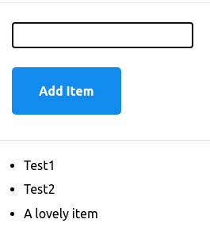

# Vue.js Workshop
A simple guide to get started with Vue.js

In this guide we'll build a simple list application in which we will add, select and delete items:




## Setup
> This project require an up-to-date node and npm installed

1. Copy the _initial_project_ folder contents
2. `npm install` (or `yarn`)
3. `npm start` (or `yarn start`)
  * This command will fail until we build out first component!
4. App will be available in `http://localhost:1234`

> A working example of the project is available in `final_project`, follow the same steps in that folder to try it

## Basics

Our basic setup uses [Parcel](https://parceljs.org/cli.html) for transpiling and bundling our source code into the _public_ folder. It will also provide a hot-reload server.

In the _src_ folder we have the basic code that we need to get started in our app development. A brief explanation of these files:
* **index.html** is our app entry point, and the base file that we will send to our users. It contains links to our stylesheet (https://andybrewer.github.io/mvp) and our Vue application (_app.js_).
* **app.js** contains our application setup and mounts our app in the `#app` element.
* components/**app.vue** is our main component (root) to be mounted inside the `#app` element.


### Building our first component
Vue components can be build in plain js, separate into multiple files, or, usually, in [**.vue** files](https://vuejs.org/v2/guide/single-file-components.html).

> A .vue file contains a single component.

Components have 3 parts:

#### Template
The template contains the code that will, eventually, be rendered as **html**.

Usually, plain **html** along with extended template syntax is used.

> When using _.vue_ files, the template will be inserted into `<template></template>` tags

#### Script
This contain the logic of our component. Ideally, all our component's logic will be inside its script, and this script should not affect other components.

The script can be written with plain **JavaScript** or **TypeScript** among other options.

Our code will, ultimately, export a single object containing all out component's state and logic.

> When using _.vue_ files, the script will be inserted into `<script></script>` tags.

#### Styles
Styles contain the **css** (or [**scss**](https://sass-lang.com/documentation/syntax)) that will be used to in the template.

These styles, by default, are applied to all the application (just like CSS works), but by defining the style as [**scoped**](https://vue-loader.vuejs.org/guide/scoped-css.html) it will only affect its component.

Usually, all styles should be scoped, global styles should be imported through global stylesheets to avoid unwanted dependencies between components.

> When using _.vue_ files, the styles will be inserted into `<style></style>` tags. It is recommended to use **scoped** styles:`<style scoped>`.

## Our first component

In our **app.vue** file, we will write the simplest component by adding some raw html to our template:

```html
<template>
  <p>Don't Panic</p>
</template>
```

As you can see, a component does not need a explicit **script** nor **styles**.

If we run our project now (`npm start`) we will get our lovely message.

However, a component with only plain HTML is not a lot of fun. Before attempting to build our app, lets make this component a bit more interesting.

### State
A component has an internal state that contains the dynamic data.

We will create a `<script>` section with out component and a `data` method that contains our state:

```html
<template>
...
</template>

<script>
module.exports = { // ES6 export syntax available
  data(){
    return {
      text: "hello world"
    }
  }
}
</script>
```

The **data** method returns an object, this object is the internal state of the component, and it is available both in the template and the rest of the component object by using **this** (e.g. `this.text`).

However, running this won't make a difference, the template is still a static HTML!.

We can easily change this by using the handy template interpolation:

```html
<template>
  <p>My component says: {{text}}</p>
</template>
```

A now we get:   


Vue will take care of updating the HTML whenever the internal state of the component changes.

> Unlike plain string concatenation, template interpolation will also take care of escaping the input to avoid HTML injection.

### Interactions
> Vue component goes brrr

We have a fancy dynamic field and a component that will react to it, but it is not very useful if we cannot change it.

We will begin by modifying the template a bit and adding a button:

```html
<template>
<div>
    <p>Counter: {{count}}</p>
    <button>Add 1</button>
</div>
</template>


<script>
module.exports = {
    data() {
        return {
            count: 0
        }
    }
}
</script>
```

> Notice the div we added. In Vue 2.x a component can only contain a single root element, so for complex components a div is usually placed on top.



Lovely! However, clicking the button doesn't do anything yet. To react to a button click, we need to listen to that button **click event**, and call a **method** when that event is triggered:

```html
<template>
    ...
    <button @click="addOne">Add 1</button>
    ...
</template>

<script>
module.exports = {
    ...
    methods: {
        addOne() {
            this.count++;
        }
    }
}
</script>
```

In our template, we listen to an event by using `@[event]`, in this case `@click` and assigning a method of the component.

Methods are defined inside the **methods** property, these methods are available in the template and through the component by using **this**.

Running the app now should work as expected. The component is listening to all button click events, and for each button the variable _count_ is increased by one and the template is rendered accordingly.


## Lets build an app
Now we can start building our list app!!

### Text input
First, we need to add a text input and "read" its value somehow, lets rewrite out template and script once more:

```html
<template>
<div>
    <input type="text" v-model="userInput"/>
    <p>{{userInput}}</p>
</div>
</template>


<script>
module.exports = {
    data() {
        return {
            userInput: ""
        }
    }
}
</script>
```

In this first version, we have a variable **userInput** that will contain the up-to-date text that the user has entered in the input. In out **input** component, the property **v-model** will take care of binding our variable to the input internal value, updating one when the other changes and vice-versa.

The variable is then rendered in the `<p>` element for debugging purposes.

> Pro tip: Using the browser extenson vue-devtools this kind debugging can be done without changing the code!



The text will update whenever the input changes. We can remove the `<p>` element now we confirmed our binding works.

## Building a list
Next, we need our items list. We will add a new variable to our data:
```js
data() {
    return {
        userInput: "",
        items: ["Test1", "Test2"]
    }
}
```

In this case we created an array, and added a couple of elements so we can see something when we render it.

We will render our list using HTML `<ul>` and `<li>`, however, because we don't know how many elements we will need, we will make our `<li>` dynamic, one per element:
```html
<template>
...
<ul>
  <li v-for="(item, i) in items" :key="i">{{item}}</li>
</ul>
</template>
```
With the property **v-for** we can render an element as many times as elements are in an array. The variables **item** and **i** contain the current item and its index respectively. These 2 variables can be used on the rendered element.

In this case, we are simply displaying the item with interpolation inside the `<li>` tag.

> The **:key** property is a requirement for loops, this ensures that items inside the loop are properly (and efficiently) rendered when the array is modified. For simple cases like this using the item index as key is enough.


## Adding items to the list
Our list is a bit static, we want to update it with out text input.

We can achieve this multiple ways, like adding a button and listening to the click event. However, to be able to also support the usual input methods (like pressing enter) we can use native forms:

```html
<template>
  ...
  <form @submit.prevent="onNewItem">
      <input type="text" v-model="userInput"/>
      <button type="submit">Add Item</button>
  </form>
  ...
</template>
```

In this example, we are using a native HTML form along with a button of type **submit**. This ensures that most usual inputs for the form are handled and captured by our **@submit** in the form (note that no event is captured in the button now).

The **.prevent** modifier prevents browser to perform the default request made when forms are submitted. Just like our click example, a method is assigned to be triggered by our event.

Now, lets implement our method:
```js
...
methods: {
    onNewItem() {
        this.items.push(this.userInput)
        this.userInput = "";
    }
}
...
```
When the user submits its input, we will simply add to the items array. The **v-for** will render the new element accordingly.

After this, we will set our userInput to an empty string. Because our **v-model** binds the `<input>` element and our variable on both ways, we will, effectively, clear the input box.



We can now remove our test items and set the initial value of items to an empty array.

## Detailed view

## Separating in components


# Vuex
