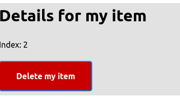

# Vue.js Workshop
_by @angrykoala_
In this guide we'll build a simple list application in which we will add, select and delete items from a list:


## Setup
> This project require an up-to-date node and npm installed

1. Copy the _initial_project_ folder contents
2. `npm install` (or `yarn`)
3. `npm start` (or `yarn start`)
  * This command will fail until we build out first component!
4. App should be available at `http://localhost:1234`

> A working example of the project is available in `final_project`, follow the same steps in that folder to try it

## Basics

Our basic setup uses [Parcel](https://parceljs.org/cli.html) for transpiling and bundling our source code into the _public_ folder. It also provides a hot-reload server.

In the _src_ folder we have the minimal code that we need to get started in our app development. A brief explanation of these files:
* **index.html** is our app entry point. It contains links to our stylesheet (https://andybrewer.github.io/mvp) and our Vue application (_app.js_).
* **app.js** contains our application setup and mounts our app in the `#app` element.
* components/**app.vue** is our main component (root) to be mounted inside the `#app` element.

> All out imports are relative to our source code, Parcel will take care of modifying the paths to use the transpiled files

### Building our first component
Vue components can be build in plain JavaScript, split into multiple files, or, usually, in [**.vue** files](https://vuejs.org/v2/guide/single-file-components.html).

> Each .vue file contains a single component.

Components have 3 parts:

#### Template
The template contains the code that will, eventually, be rendered as **html**.

Usually, plain **html** along with an extended template syntax is used.

> In _.vue_ files, the template will be inserted into `<template></template>` tags.

#### Script
This contain the logic of our component. Ideally, all our component's logic will be inside its own script, and it should not affect other components.

The script can be written with plain **JavaScript** or **TypeScript** among other options.

Our code will export a single object containing all out component's state and logic.

> When using _.vue_ files, the script will be inserted into `<script></script>` tags.

#### Styles
Styles contain the **css** (or [**scss**](https://sass-lang.com/documentation/syntax)) that will be used in the template.

These styles, by default, are applied to all the application, but by defining the style as [**scoped**](https://vue-loader.vuejs.org/guide/scoped-css.html) it will only affect its component.

Usually, all styles should be scoped, global styles can be imported through global stylesheets to avoid unwanted dependencies between components.

> When using _.vue_ files, the styles will be inserted into `<style></style>` tags. It is recommended to use **scoped** styles: `<style scoped>`.

## Our first component

In our **app.vue** file, we will write the simplest component by adding some raw html to our template:

```html
<template>
  <p>Don't Panic</p>
</template>
```

As you can see, a component doesn't need a explicit **script** nor **styles**.

If we run our project now (`npm start`) we will get our lovely message.

However, a component with only plain HTML is not a lot of fun. Before attempting to build our app, lets make this component a bit more interesting.

### State
A component has an internal state that contains the dynamic data.

We will create a `<script>` section with a `data` method that contains our state:

```html
<template>
...
</template>

<script>
module.exports = { // ES6 export syntax also available
  data() {
    return {
      text: "hello world"
    }
  }
}
</script>
```

The **data** method returns an object, this object is the internal state of the component, and it is available both in the template and the rest of the component object by using **this** (e.g. `this.text`).

However, running this won't make a difference, the template is still a static HTML!.

We can easily change this by using [template interpolation](https://vuejs.org/v2/guide/syntax.html#Interpolations):

```html
<template>
  <p>My component says: {{text}}</p>
</template>
```

A now we get:   


Vue will take care of updating the HTML whenever the internal state of the component changes.

> Unlike plain string concatenation, template interpolation will also take care of escaping the input to avoid HTML injection.

### Interactions
> Vue component goes brrr

We have a fancy dynamic field and a component that will react to it, but it is not very useful if we cannot change it.

We will begin by modifying the template a bit by adding a button:

```html
<template>
<div>
    <p>Counter: {{count}}</p>
    <button>Add 1</button>
</div>
</template>


<script>
module.exports = {
    data() {
        return {
            count: 0
        }
    }
}
</script>
```

> Notice the div we added. In Vue 2.x a component can only contain a single root element, so for complex components a everything is wrapped inside a div


Lovely! However, clicking the button doesn't do anything yet. To react to a button click, we need to listen to that button **click event**, and call a **method** when that event is triggered:

```html
<template>
    ...
    <button @click="addOne">Add 1</button>
    ...
</template>

<script>
module.exports = {
    ...
    methods: {
        addOne() {
            this.count++;
        }
    }
}
</script>
```

In our template, we listen to an event by using `@[event]`, in this case `@click` and assigning a method of the component.

Methods are, unsurprisingly, defined inside the **methods** property, these methods are available in the template and through the component by using **this**.

Running the app now should work as expected. The component is listening to all button click events, and for each button the variable _count_ is increased by one and the template is rendered accordingly.


## Lets build an app

### Text input
First, we need to add a text input and "read" its value somehow, lets rewrite out template and script once more:

```html
<template>
<div>
    <input type="text" v-model="userInput"/>
    <p>{{userInput}}</p>
</div>
</template>


<script>
module.exports = {
    data() {
        return {
            userInput: ""
        }
    }
}
</script>
```

In this first version, we have a variable **userInput** that will contain the up-to-date text that the user has entered in the input. In out **input** component, the property **v-model** will take care of binding our variable to the input internal value, updating one when the other changes and vice-versa.

The variable is then rendered in the `<p>` element for debugging purposes.

> Pro tip: Using the browser extenson vue-devtools this kind debugging can be done without changing the code!


The text will update whenever the input changes. We can remove the `<p>` element now we confirmed our binding works.

## Building a list
Next, we need our items list. We will add a new variable to our data:
```js
data() {
    return {
        userInput: "",
        items: ["Test1", "Test2"]
    }
}
```

In this case we will use an array, and add a couple of elements so we can see something when we render it.

We will render our list using HTML `<ul>` and `<li>`, however, because we don't know how many elements we will need, we will make our `<li>` dynamic, one per element by using **[v-for](https://vuejs.org/v2/guide/list.html)**:
```html
<template>
...
<ul>
  <li v-for="(item, i) in items" :key="i">{{item}}</li>
</ul>
</template>
```
With the property **v-for** we can render an element for each item are in an array. The variables **item** and **i** contain the current item and its index respectively. These 2 variables can be used in the rendered element.

In this case, we are simply displaying the item with interpolation inside the `<li>` tag.

> The **:key** property is a requirement for loops, this ensures that items inside the loop are properly (and efficiently) re-rendered when the array is modified. For simple cases like this using the item index as key is enough.

## Adding items to the list
We will now add new items to the list through our input.

We can achieve this multiple ways, like adding a button and listening to the click event. However, to be able to also support the default input methods (like pressing enter) we can use native forms:

```html
<template>
  ...
  <form @submit.prevent="onNewItem">
      <input type="text" v-model="userInput"/>
      <button type="submit">Add Item</button>
  </form>
  ...
</template>
```

In this example, we are using a native HTML form along with a button of type **submit**. This ensures that default inputs for the form are handled and captured by our **@submit** event in the form. We don't need to capture any event in the button now).

The **.prevent** modifier prevents browser to perform the default request made when forms are submitted. Just like our click example, a method is assigned to be triggered by our event.

Now, lets implement our method:
```js
...
methods: {
    onNewItem() {
        this.items.push(this.userInput)
        this.userInput = "";
    }
}
...
```
When the user submits its input, we will simply add to the items array. The **v-for** will render the new element.

After this, we will set our userInput to an empty string. Because our **v-model** binds the `<input>` element and our variable on both directions, we will, effectively, clear the input box.


We can now remove our test items and set the initial value of items to an empty array.

## Detailed view
We want to interact with our list items as well. Clicking on them should open a detailed view of the item, with options such as **delete**.



First, we will need a variable in data to hold our selected item:

```js
data() {
    return {
        userInput: "",
        items: [],
        selectedItemIndex: null,
    }
}
```

Now, by adding a `@click` event to our items and passing the **index** (i) from the `v-for` directive, we can update this variable:

```html
<template>
...
<li v-for="(item, i) in items" :key="i" @click="itemClicked(i)">{{item}}</li>
...
</template>

<script>
...
methods: {
  ...
  itemClicked(i) {
      this.selectedItemIndex = i;
  }
}
...
</script>
```

Note that event callbacks may receive parameters, in this case we send the index of our selected item.

> **Pro-tip:** We could use `<a>` elements for the clickable items instead of raw text.

Now, we have everything we need for our detailed view. Let's begin by updating our template:

```html
<template>
  ...
  <div>
      <h1>Details for {{items[selectedItemIndex]}}</h1>
      <p>Index: {{selectedItemIndex}}</p>
      <button @click="onDelete">Delete {{items[selectedItemIndex]}}</button>
  </div>
</template>
```

And adding the **onDelete** method:
```js
onDelete() {
    this.items.splice(this.selectedItemIndex, 1);
    this.selectedItemIndex = null;
}
```


### Conditional rendering
Now, our Detailed View is always visible, even if no item is selected. To avoid rendering it until an item is selected, we can use the `v-if` directive.

`v-if` allows us to render an element in our template only if a condition is met, in this case, we only want our detailed view to be rendered if an item is selected:

```html
<template>
  ...
  <div v-if="selectedItemIndex!==null">
      <h1>Details for {{items[selectedItemIndex]}}</h1>
      ....
  </div>
</template>
```

> Like **v-if**, Vue templates also provide a **vue-else** and **vue-else-if**

### Computed properties
Adding complex logic in our templates that depend on reactive variables will soon lead to hard to maintain code, in the example above our `v-if` logic is still pretty simple, but it is easy to imagine how the condition may grow.

Instead of trying to use a method or an extra property, to decouple the logic from the template without compromising performance, we will use Vue [computed properties](https://vuejs.org/v2/guide/computed.html).

A computed property is somewhat similar to **getters** in classes, as they are methods that can be used as properties, however, properties have 2 key differences:
* A computed property will be reactive, just like normal properties.
* A computed property uses some sort of memoization (unlike methods or [watchers](https://vuejs.org/v2/guide/computed.html#Watchers)) so it is only executed when referenced properties change. This means that even costly operations can be efficiently delegated to a computed property.

In our example, lets move our `selectedItemIndex!==null` to a computed property:

```html
<template>
  ...
  <div v-if="showDetail">
      ....
  </div>
</template>

<script>
module.exports = {
    data() {
      // ...
    },
    methods: {
      // ...
    },
    computed:{
      showDetail(){
        return this.selectedItemIndex!==null
      },
    }
}

</script>
```

In this example, `showDetail` acts as a read-only property that can be accessed in the template or methods of the component.

It's implemented like methods, but under the **computed** section. Computed properties have access to the component state and its methods, the _memoization_ happens automatically on the reactive properties used, in this example the `showDetail` will always be in sync with the `selectedItemIndex`.

### Add some style 🕶️

We have a detailed view, but we need some extra **css styles** for it to look nice!

To add styles to our component, we will add a class to our element and will include a new `<style>` section:


```html
<template>
  ...
  <div v-if="showDetail" class="detailed-view">
    ...
  <div>
</template>

<script>
// ...
</script>


<style lang="scss" scoped>
.detailed-view {
    background-color: #e2e2e2;

    button {
        background-color: #c90000;
    }
}
</style>
```

The `<style>` directive, by default, will contain `css` styles that will be injected into the final page. The 2 extra directives are optional:
* **lang**: This define the language to use, in this case we will be using [scss](https://sass-lang.com/documentation/syntax) instead of plain css.
* **scoped**: This marks the css to **only** affect the current component. It is recommended to **always** add this directive, and delegate any global styles to a common css file.

Because our styles are scoped, we do not need to worry about colliding classes in other components.

> The content of the `<style>` **scss** code, which works similarly to css. Plain **css** can also be used.


## Split into components

As our application grows, using a single component stops being efficient, we will need to split our application into separate components eventually.

Because a Vue app is, in itself, a component (root), all other components will hang from it, so our app will end up structured like a tree.

Each component will, ideally, contain a template, logic and style decoupled from other components, so we can move and reuse each component as a self-contained entity. In real apps, however, components need to communicate to update and react. To achieve this we use **props** and **events**.


* **Props**: A parent can send reactive properties to its children, each time this data changes, the child will render.
* **Events**: Like the `@click` event we already used in a button, out components can also emit custom events that the parent may capture to update itself.

> Props+Events are the default ways of communication between components in Vue, but as our application grows, other tools such as [Vuex](https://vuex.vuejs.org) become necessary.

### Detailed view
Let's move our **detail** view into a separate component in a new file `detail.vue`.

```html
<template>
<div class="detailed-view">
    <h1>Details for {{item}}</h1>
    <p>Index: {{itemIndex}}</p>
    <button @click="onDelete" class="delete-button">Delete {{item}}</button>
</div>
</template>

<script>
module.exports = {
    props: ['item', 'itemIndex'],
    methods: {
        onDelete() {
            // TODO
        }
    }

}
</script>

<style lang="scss" scoped>
.detailed-view {
    background-color: #e2e2e2;

    button {
        background-color: #c90000;
    }
}
</style>
```
_detail.vue_

Most of the template and style are the same as the original component.

**Props** are data properties sent from the parent component, in this example, we will receive **item** and **itemIndex** from the parent component. Just like `data` properties, props can be used in the template and the rest of the component.

Lets adapt our **root** component to use the new component and pass the required props:

```html
<template>
...
<detail v-if="showDetail" :item="items[selectedItemIndex]" :itemIndex="selectedItemIndex"></detail>
</template>


<script>
const components = {
  'detail': require('./detail.vue') // ES6 imports also availabe
}

module.exports = {
    components,
    // ...
}
</script>
```
_app.vue_

First, we import our component using `require('./detail.vue')` and add it to our root component with the directive `components`.

**Components** is an object with the key being the name to be used in the template.

We can now use a `<detail>` tag to inject the component into our template. By using `:[propName]` we can pass our props to the component. Note that props can be from the internal state, computed properties or other props.

We can also use our `v-if` directive directly on this component, so it is not rendered unless needed.

> We can also, remove all the contents of our `<style>`, as the detail component already has its own styles.

### Using events

Our detailed view looks great, but the `delete` button is not working anymore.

We can listen to our event in the detail component, but to perform the action we need the parent component to be aware of it as well. To do this, we can **emit** an event from the child to the parent.

```js
onDelete() {
    this.$emit("deleteItem", this.itemIndex);
}
```
_detail.vue_

Now we can capture the event `deleteItem` in the same fashion as other events like `click`

```html
<detail ... @deleteItem="onDelete"></detail>
```

And now, our list application is finished and working.

> Another improvement to be done is extract the whole list into a separate component, to reduce complexity of the root component.

# Vuex
In this section, we will include [Vuex](https://vuex.vuejs.org). The most common state management library for Vue.

While props+events will usually cover most of our inter-component communication needs, most medium and large applications will require some data to be shared between several components, and moving this data along our tree becomes increasingly problematic. For this cases, a common state object is required.

> As a rule of thumb, when the data is shared between a parent and child component, or between siblings, props+events are the preferred way of sharing data, as this keeps the components encapsulation, which is usually broken for common state data.

In out application, we will setup a **Vuex store** and add our list as the common data. We will then request this list to a fake API to emulate a real case with a server.

## Vuex Setup

Most of the required setup is already commneted in _app.js_:

```js
'use strict';

const Vue = require('vue/dist/vue.common');
const Vuex = require("vuex").default;

Vue.use(Vuex);

const app = require('./components/app.vue');
const store = require("./store");

module.exports = new Vue({
    el: '#app',
    store,
    render: h => h(app)
});
```
_app.js_

First, we are importing **Vuex** and adding it to Vue as a plugin. We now need to import our store and add it to our root component so it is available to all the application.

## Vuex Store
We will create a _store.js_ file:

```js
"use strict";
const Vuex = require("vuex").default;

module.exports = new Vuex.Store({
    state: {
        items: []
    },
    getters: {
    },
    mutations: {
        addItem(state, item) {
            state.items.push(item);
        },
        deleteItem(state, index) {
            state.items.splice(index, 1);
        },
    },
    actions: {
    }
});
```
_store.js_

A **Vuex** store may have the following properties/sections:
* **state** defines the properties of the store and the default values.
* **getters** will execute and memoize a dynamic a read-only property.
* **mutations** are **synchronous** methods that modify the state.
  * The state should only be modified inside mutations.
  * In out store, we added mutations for add and remove elements from our items list.
* **actions** are **asynchronous** methods that commit mutations.

> Vue Devtools plugin has access to the store and lists all the mutations for debugging purposes.

## Using the store
In our components we can now access the store by using `this.$store`.

> Using $ is a convention for properties common to all Vue components such as `$emit` or `$store`

We can now remove the "items" property in the root state and item props and use the store instead

```html
<template>
  ...
  <detail v-if="showDetail" :itemIndex="selectedItemIndex" @deleteItem="onDelete"></detail>
  ...
</template>

<script>
...
computed: {
  ...
  items() { // Using a computed property to reduce verbosity
    return this.$store.state.items;
  }
}
</script>
```
_app.vue_

```html


<script>
...
computed: {
  item() {
    return this.$store.state.items[this.itemIndex];
  }
}
</script>

```
_detail.vue_

This ensures that our items list in the store is the truth source of our data for all our components, with more dynamic things like user interaction (`selectedIndex` or `userInput`) still encapsulated in the components that provide that interaction.

### Modifying the store

We should not modify the store state directly, instead, we will use the **mutations** we defined in the store in our root component by calling `$store.commit`:

```html
<script>
methods: {
    onNewItem() {
        this.$store.commit("addItem", this.userInput);
        this.userInput = "";
    },
    onDelete() {
        this.$store.commit("deleteItem", this.selectedItemIndex);
        this.selectedItemIndex = null;
    },
    ...
},
</script>
```
_app.vue_

## Using an external API
We will now fetch our list from an external (fake) API.

First we will add a *fake_api.js* file:
```js
"use strict";

module.exports = {
    fetchItems() {
        return new Promise((resolve, reject) => {
            setTimeout(() => {
                resolve(["eggs", "milk"])
            }, 3000)
        })
    }
}
```
*fake_api.js*

In a real application, this method would perform a request.

### Vuex actions
Vuex mutations are synchronous, for cases where the update needs to be done asynchronous, like in requests, we will use `actions` instead:

```js
...
mutations: {
    ...
    replaceItems(state, items) {
        state.items = items
    }
},
actions: {
    fetchItems(context) {
        return fakeApi.fetchItems().then((items) => {
            context.commit("replaceItems", items);
        })
    }
}
```
_store.js_

Now, the `fetchItems` action will perform the request, and, eventually, call the `replaceItems` mutation.

### Using actions
Just like mutations, actions need to be called through a method `dispatch`.

We will call our `fetchItems` action in our root component when it loads. We can do it by using our components [lifecycle hooks](https://vuejs.org/v2/guide/instance.html#Instance-Lifecycle-Hooks):

```html
<script>
module.exports = {
  ...
  mounted() {
      this.$store.dispatch("fetchItems");
  },
  ...
}
</script>

```
_app.vue_

The hook `mounted` will be called once the component is ready to be used, because we are working with our root component, this will only be called once when the page has loaded.

Inside the mounted hook we call our action by using **dispatch**. Because our action will update the store state, our application will react to these changes once the request is complete.

If we now reload out page, we see that, after 3 seconds, it loads the list provided by our API.

### Loading spinner
Because our API takes so long to load the list, we do not want to show nor allow edition on this list until the request has finished.

This can be achieved in several ways, in this case, we will use a property `ready` in our root component.

```html
<script>
...
module.exports = {
  data() {
      return {
          ...
          ready: false
      }
  },
  mounted() {
    this.$store.dispatch("fetchItems").then(() => {
        this.ready = true
    })
  },
  ...
}
</script>
```
_app.vue_

Using this approach, we can update the `ready` flag once the promise returned by the action is resolved.

> Alternatively, the ready flag may be a store property or a getter, updated by the action.

Now, we need to render a loading message until our ready flag is true:

```html
<template>
  <div>
    <template v-if="ready">
      ...
    </template>
    <p v-else>LOADING</p>
  </div>
</template>
```
_app.vue_

The first thing that we will notice, is the extra `<template>` tag inside our template. This tag simply tells Vue that the **v-if** directive affects all the elements inside it. The same can be achieved by using a `<div>` but template won't render in the final html.

After the template, the new `<p>` element uses **v-else** that behaves as you could expect.
